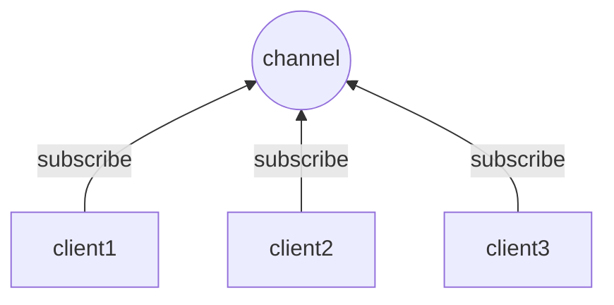
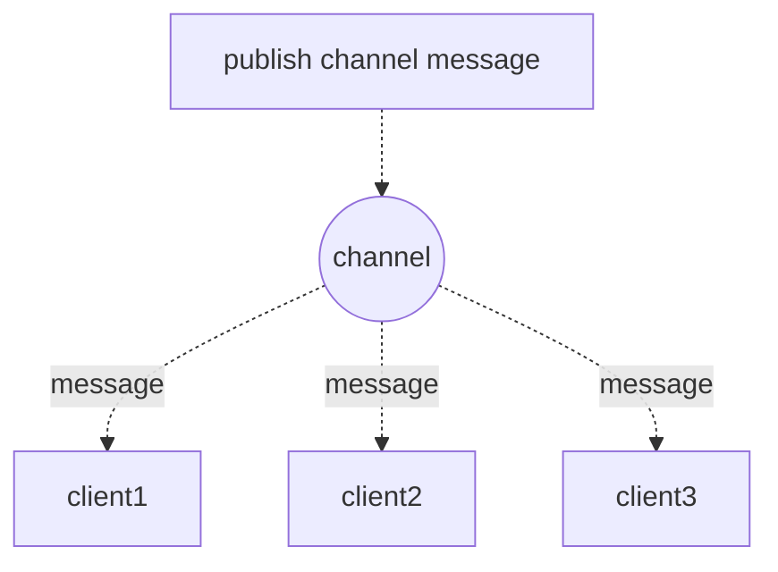

# Redis进阶篇一

## 1. Redis HyperLogLog

### 1.1 HyperLogLog 是什么

Redis HyperLogLog 是用来做基数统计的算法，每个 HyperLoglog 键只需要占用 12KB 内存，就可以计算接近 2<sup>64</sup> 个不同的基数。HyperLogLog 的优点是在应对大量数据事可以利用极小且固定的空间完成对独立总数的统计，但缺点是它的统计并不十分准确，存在一定误差。HyperLogLog 只会根据输入的元素来统计基数，而不会存储输入的元素，因此相比于 Set 集合类型，它不会出现元素越多占用内存多大的情况，但是它也不能像 Set 类型一样返回输入的元素。
> **基数**： 数据集中不同元素的个数。例如数据集 {8, 7, 3, 1, 0, 2, 1, 0} 中，基数集为 {8, 7, 3, 1, 0 , 2}，基数为 6。

### 1.2 HyperLogLog 命令

1. **PFADD key element1 [element2]**：向 HyperLogLog 键 key 中添加一个或多个元素。至少有一个元素被添加返回 1，否则返回 0。

    ```
    > PFADD test1 a b c d
    (integer) 1
    > PFADD test1 a
    (integer) 0
    ```

2. **PFCOUNT key1 [key2]**：返回给定 HyperLogLog 的基数估算值，多个 HyperLogLog 时返回基数值之和。

    ```
    > PFCOUNT test1
    (integer) 4
    > PFADD test2 e f g
    (integer) 1
    > PFCOUNT test1 test2
    (integer) 7
    ```

3. **pfmerge destkey sourcekey1[sourcekey2]**：将多个 HyperLogLog 合并为一个 HyperLogLog ，合并后的 HyperLogLog 的基数估算值是通过对所有给定 HyperLogLog 进行并集计算得出的。

    ```
    > PFMERGE test test1 test2
    OK
    > PFCOUNT test
    (integer) 7
    ```

### 1.3 应用场景

由于 HyperLogLog 可以对基数进行统计，因此我们常常用于统计独立访客(Unique Visitor, 简称 UV)。比如今天有多少个人已经进行了签到或访问过，即使一天之内多次访问，对于总数来说还是只增加 1。

## 2. Redis 发布订阅

### 2.1 简介

由于 Redis 发布订阅机制本身的不足，实际中的消息通信并不常用 Redis 发布订阅完成，因此仅介绍一下。

> **为什么不用 Redis 发布订阅机制**
>
> - **数据可靠性原因**：Redis 发布订阅要求客户端在线，由 1 个客户端发布消息，n 个客户端接收消息，且消息的发布是**无状态**的。比如我们使用微信时，消息未发送成功会有红色感叹号提醒，发出去的消息在短时间内仍可以撤回，对方上线后仍可以接收到消息，但 Redis 无法实现这些功能，它无法判断消息是否被接受了还是在传输过程中丢失了。
> - **稳定性原因**：对于旧版的 Redis 来说，如果一个客户端订阅了某个或者某些频道，频道推送了很多消息但是它读取消息的速度不够快，那么不断积压的消息就会使得 Redis 输出缓冲区的体积越来越大，这可能会导致 redis 的速度变慢，甚至直接崩溃。也可能会导致 Redis 服务被操作系统强制杀死，甚至导致操作系统本身不可用。新版的 redis 不会出现这种问题，因为它会自动断开不符合 client-output-buffer-limit pubsub 配置选项要求的订阅客户端。
> - **资源消耗高**：在 pub/sub 中发送者不需要独占一个 Redis 的链接，而订阅者则需要单独占用一个 Redis 的链接，而发布订阅一般对应多个订阅者，此时则有着过高的资源消耗。

Redis 发布订阅(pub/sub)是一种消息通信模式：发送者(pub)发送消息，订阅者(sub)接收消息。
Redis 客户端可以订阅任意数量的频道。
下图展示了频道 channel 以及订阅了这个频道的三个客户端 client1、client2、client3 之间的关系：



当有新消息通过 publish 命令发送给频道 channel 时，这个消息就会被发送给订阅它的三个客户端：



### 2.2 命令

1. **PSUBSCRIBE pattern [pattern ...]**：订阅一个或多个符合给定模式的频道。
2. **PUBLISH channel message**：将信息发送到指定频道。
3. **PUNSUBSCRIBE [pattern [pattern ...]]**：退订所有给定模式的频道。
4. **SUBSCRIBE channel [channel ...]**：订阅一个或多个频道。
5. **UNSUBSCRIBE channel [channel ...]**：退订一个或多个频道。


### 2.3 简单实例

简单演示一下 Redis 发布订阅，首先我们打开一个客户端订阅频道 channel1：

```
> SUBSCRIBE channel1
Reading messages... (press Ctrl-C to quit)
1) "subscribe"
2) "channel1"
3) (integer) 1
```

然后，我们再打开一个客户端，并向频道 channel1 发布一条消息：

```
> PUBLISH channel1 "test message"
(integer) 1
```

此时，订阅了频道 channel1 的客户端会接受到消息，会多出以下几行：

```
1) "message"
2) "channel1"
3) "test message"
```


## 3. Redis 事务

### 3.1 事务简介

Redis 事务可以一次执行多个命令，并且带有以下三个重要的保证：

1. 批量操作在发送 EXEC 命令之前都被放入队列缓存。
2. 收到 EXEC 命令之后开始执行事务，事务中任意命令执行失败，其余命令依旧执行。
3. 在事务执行过程中，其他客户端发出的命令请求不会插入到事务执行队列中。

由上述三个保证我们可以看出虽然 Redis 保证单个命令的执行是原子性的，但并没有在事务上增加任何保持原子性的机制，所以 Redis 事务的执行并不是原子性的。这不像 MySQL 数据库中的事务，在 MySQL 事务中，若有一条命令执行失败，则会发生事务回滚。Redis 中事务中的某一条命令执行失败既不会造成已完成命令的回滚，也不会影响未完成命令的执行。

### 3.2 事务命令

1. **MULTI**：标记一个事务块的开始。
2. **EXEC**：执行事务块内的所有命令。
3. **DISCARD**：取消事务，放弃执行事务块内的所有命令。
4. **WATCH key [key ...]**：监视一个或多个 key，如果在事务执行之前被监视的 key 被其他命令所改动，则取消执行事务。
5. **UNWATCH**：取消对 WATCH 命令中所有 key 的监视。

### 3.3 实例

一个事务从开始到执行会经历以下三个阶段：


```
# 监视 key，事务成功执行
> WATCH name1 score1
OK
> MULTI		# 开始事务
OK
> SET name1 "Jack"
QUEUED
> SET score1 80
QUEUED
> EXEC		# 执行事务
1) OK
2) OK
```

下图演示了监视 key 但事务被打断的情况：


## 4. Redis 脚本

Redis 脚本使用 Lua 解释器来执行脚本。由于作者对 Lua 没什么了解，这里就只能网罗些有用的信息，简单介绍。

### 4.1 脚本命令

1. **EVAL script numkeys key [key ...] arg [arg ...]**：执行 Lua 脚本。numkeys 指定 key 和 arg 的个数。

    ```
    > EVAL "return {KEYS[1],KEYS[2],ARGV[1],ARGV[2]}" 2 key1    key2 arg1 agr2
    1) "key1"
    2) "key2"
    3) "arg1"
    4) "arg2"
    ```

2. **SCRIPT LOAD script**：将脚本 script 添加到脚本缓存中，但不立即执行,返回 SHA1 校验和。

    ```
    > SCRIPT LOAD "return 'hello world'"
    "5332031c6b470dc5a0dd9b4bf2030dea6d65de91"
    ```

3. **EVALSHA sha1 numkeys key [key ...] arg [arg ...]**：根据给定的 sha1 校验码，执行缓存在服务器中的脚本。

    ```
    > SCRIPT LOAD "return {KEYS[1],KEYS[2],ARGV[1],ARGV[2]}"
    "a42059b356c875f0717db19a51f6aaca9ae659ea"
    > EVALSHA "a42059b356c875f0717db19a51f6aaca9ae659ea" 2 key1 key2 arg1 arg2
    1) "key1"
    2) "key2"
    3) "arg1"
    4) "arg2"
    ```

4. **SCRIPT EXISTS script [script ...]**：通过 SHA1 校验和判断指定脚本是否被保存在缓存中。

    ```
    > SCRIPT LOAD "return 'hello world'"
    "5332031c6b470dc5a0dd9b4bf2030dea6d65de91"
    > SCRIPT LOAD 5332031c6b470dc5a0dd9b4bf2030dea6d65de91
    1) (integer) 1
    ```

5. **SCRIPT FLUSH**：清空缓存中的所有脚本。
   
    ```
    > SCRIPT FLUSH
    OK
    > SCRIPT LOAD 5332031c6b470dc5a0dd9b4bf2030dea6d65de91  # "return 'hello world'"的SHA1校验和
    1) (integer) 0
    ```
6. **SCRIPT KILL**：杀死目前正在运行的脚本。

### 4.2 使用优势

开发者可以使用 Lua 语言编写脚本传到 Redis 中执行。在 Lua 脚本中可以调用大部分 Redis 命令。使用 Redis 脚本有以下几个优势：

- **减少网络开销**：通过脚本可以一次发送多个请求，减少网络延迟。
- **原子性**：Redis 将脚本作为一个整体执行，过程中不会被其他命令插入，也无需使用事务，换言之，事务可以做的，脚本都可以做。
- **复用性**：客户端发送的脚本永久存储在 Redis 中，其他客户端在实现相同功能时可以直接复用而不必重复编写代码。
- **可嵌入性**：可嵌入 JAVA，C# 等多种编程语言，支持不同操作系统跨平台交互。
