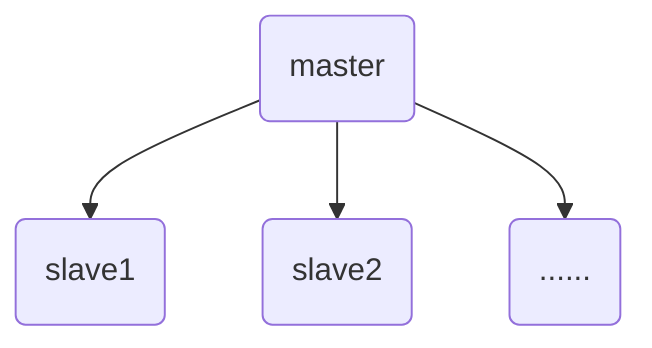

# Redis进阶篇三——主从复制

## 1. 主从复制概述

前面几篇内容我们都是在一台 Redis 服务器上进行操作，包括数据的读、写以及备份操作。本篇要介绍的主从复制，是指将一台 Redis 服务器的数据，复制到其他 Redis 服务器，我们将前者称为主节点 master，将后者称为从节点 slave。在这个过程中，**数据的复制是单向的，即只能从主节点到从节点**。
在默认情况下，我们开启的每台 Redis 服务器都是独立的主节点，在主从复制中，**一个主节点可以有多个从节点，但一个从节点只能有一个主节点**。如下图所示：

主从复制的作用主要包括：

1. **数据冗余**：主从复制实现了数据的热备份，是持久化之外的一种数据冗余方式。
2. **故障恢复**：当主节点出现问题时，可以由从节点提供服务，实现快速的故障恢复；实际上是一种服务的冗余。
3. **负载均衡**：在主从复制的基础上，配合读写分离，写数据时应用连接主节点，读数据时应用连接从节点，分担服务器负载；尤其是在写少读多的场景下，通过多个从节点分担读负载，可以大大提高 Redis 服务器的并发量。
4. **高可用基础**：主从复制是哨兵模式和集群能够实施的基础。

## 2. 实现原理

主从复制的实现过程大致可以分为3个阶段：**建立连接、数据同步、命令传播**。

### 2.1 建立连接阶段

在实现主从复制的第一步当然是主从节点之间建立连接，这一阶段也可以称为准备阶段，主要包含了以下几个步骤：

1. **保存主节点信息**
   
   从节点服务器内部包含了 masterhost 和 masterport 字段，分别存储了主节点的 IP 和 port 信息。slaveof 是异步命令，从节点完成主节点 IP 和 port 的保存后，向发送 slaveof 命令的客户端直接返回 OK，实际的复制操作在这之后才开始进行。
   &nbsp;
   
2. **建立 socket 连接**

   从节点每秒调用 1 次复制定时函数 replicationCron()，如果发现了有主节点可以连接，便会根据主节点的 IP 和 port，创建 socket 连接。连接成功后从节点会为该 socket 建立一个专门处理复制工作的文件事件处理器，负责后续的复制工作，如接收 RDB 文件、接收命令传播等；主节点在接收到从节点的 socket 连接后（即 accept 之后），为该 socket 创建相应的客户端状态，并将从节点看做是连接到主节点的一个客户端，后面的步骤会以从节点向主节点发送命令请求的形式来进行。
   &nbsp;

3. **发送 ping 命令**

   从节点成为主节点的客户端之后，发送 ping 命令进行首次请求，**目的是检查 socket 连接是否可用，以及主节点当前是否能够处理请求**。从节点发送 ping 命令后，可能出现 3 种情况：

   1. 返回 pong：说明 socket 连接正常，且主节点当前可以处理请求，复制过程继续。
   2. 超时：一定时间后从节点仍未收到主节点的回复，说明 socket 连接不可用，则从节点断开 socket 连接，并重连。
   3. 返回 pong 以外的结果：如果主节点返回其他结果，如正在处理超时运行的脚本，说明主节点当前无法处理命令，则从节点断开 socket 连接，并重连。
   &nbsp;

4. **身份验证**

   如果从节点中配置文件中设置了 masterauth 选项，则从节点需要向主节点进行身份验证；没有设置该选项，则不需要验证。从节点进行身份验证是通过向主节点发送 auth 命令进行的，auth 命令的参数即为配置文件中的 masterauth 的值。如果主节点设置密码的状态与从节点 masterauth 的状态一致（一致是指都存在，且密码相同，或者都不存在），则身份验证通过，复制过程继续；如果不一致，则从节点断开 socket 连接，并重连。
   &nbsp;

5. **发送从节点端口信息**

   身份验证之后，从节点会向主节点发送其监听的端口号，主节点将该信息保存到该从节点对应的客户端的 slave_listening_port 字段中。该端口信息除了在主节点中执行 **info replication** 命令时显示以外，没有其他作用。

### 2.2 数据同步阶段

在主从节点之间建立连接之后，就可以开始进行数据的同步，这一阶段也可以理解是从节点中数据的初始化。
Redis 的数据同步有两个重要的命令：**sync** 和 **psync**，sync 命令是 Redis2.8 以前请求同步数据的命令，同步方式是全量复制；psync 命令是 Redis2.8 算是对 sync 优化后的命令，同步方式可以是全量复制或增量复制。
这里提到两个数据同步的关键：**全量复制**和**增量复制**，先做个简单介绍：

- **全量复制**：用于初次复制或其他无法进行增量复制的情况，将主节点中的所有数据都发送给从节点。
- **增量复制**：用户网络中断等情况的复制，只将中断期间主节点执行的写命令发送给从节点，相比于全量复制更加高效。

> 如果网络中断的时间过长，会导致主节点没有能够完整地保存中断期间执行的写命令，则无法进行增量复制，仍使用全量复制。

#### 2.2.1 psync命令

在讲解 psync 命令之前，我们先讲几个需要知道的概念：

1. **复制偏移量 ( offset )**
   
   主节点和从节点会各自维护一个复制偏移量 ( offset )，代表的是**主节点向从节点传递的字节数**。主节点每次向从节点传播 N 个字节数据时，主节点的 offset 增加 N；同理，当从节点每次收到主节点传来的 N 个字节数据时，从节点的 offset 增加 N。offset 的值我们可以通过 **info replication** 命令返回的信息中看到。通过比较主节点和从节点的 offset 可以判断数据库状态是否一致，如果两者的 offset 相同，则一致，否则不一致；也可以根据两者的 offset 找出从节点缺少的数据。
   &nbsp;
   
2. **复制积压缓存区**

   复制积压缓存区是由主节点维护的一个固定长度的先进先出 ( FIFO) 队列，默认大小是 1MB。当主节点开始有从节点时，主节点创建复制积压缓存区，其**作用是备份主节点最近发送给从节点的数据**。
   在命令传播阶段，主节点除了将写命令发送给从节点，还会发送一份给复制积压缓冲区，作为写命令的备份；除了存储写命令，复制积压缓冲区中还存储了其中的每个字节对应的复制偏移量 ( offset )。由于复制积压缓冲区定长且是先进先出，所以它保存的是主节点最近执行的写命令；时间较早的写命令会被挤出缓冲区。
   由于该缓冲区长度固定且有限，因此可以备份的写命令也有限，当主从节点 offset 的差距过大超过缓冲区长度时，将无法执行增量复制，只能执行全量复制。因此从节点将 offset 发送给主节点后，主节点根据 offset 和缓冲区大小决定能否执行增量复制：

   - 如果 offset 偏移量之后的数据仍然在复制积压缓冲区里，则执行增量复制
   - 如果 offset 偏移量之后的数据已不在复制积压缓冲区中（数据已被挤出），则执行全量复制

   &nbsp;

3. **服务器运行ID ( runid )**

   不论是主节点还是从节点，在启动时都会自动生成一个随机 ID ( runid )，由 40 个随机的十六进制字符组成且每次启动都不一样。如果使用 IP 和 port 的方式识别一个节点，那么当主节点重启修改了 RDB/AOF 数据，从节点再基于偏移量进行复制将是不安全的，因此 **runid 的主要作用是唯一识别一个 Redis 节点**。通过 **info server** 命令可以查看节点的 runid。
   主从节点初次复制时，主节点将自己的 runid 发送给从节点，从节点将这个 runid 保存起来；当断线重连时，从节点会将这个 runid 发送给主节点；主节点根据发送来的 runid 和当前自己的 runid 是否相同判断能否进行增量复制：

   - 如果相同，说明主从节点之前同步过，主节点会继续尝试使用增量复制 ( 到底能不能增量复制还要看 offset 和复制积压缓冲区的情况 )
   - 如果不同，说明从节点在断线前同步的 Redis 节点并不是当前的主节点，只能进行全量复制

   &nbsp;
   **psync 命令的格式：psync < runid > < offset >**
   **psync 的执行流程**：

首先从节点根据是否执行过 slaveof 命令决定如何调用 psync 命令：

- 之前从未执行过 slaveof 或最近执行了 slaveof no one，则从节点发送 psync ? -1 命令，向主节点请求全量复制
- 之前执行了 slaveof，则发送 psync < runid > < offset > 命令，其中 runid 为上次复制的主节点的 runid，offset 为上次复制截止时从节点保存的复制偏移量

主节点根据收到的 psync 命令以及当前服务器的状态，决定执行全量复制还是增量复制：

- 如果主节点版本低于 Redis2.8，则返回 -ERR 回复，此时从节点重新发送 sync 命令执行全量复制
- 如果主节点版本够新，且 runid 与从节点发送的 runid 相同，且从节点发送的 offset 之后的数据在复制积压缓冲区中都存在，则回复 +CONTINUE，表示将执行增量复制，从节点等待主节点发送其缺少的数据即可
- 如果主节点版本够新，但是 runid 与从节点发送的 runid 不同，或从节点发送的 offset 之后的数据已不在复制积压缓冲区中(在队列中被挤出了)，则回复 +FULLRESYNC < runid > < offset >，表示要进行全量复制，其中 runid 表示主节点当前的 runid，offset 表示主节点当前的 offset，从节点保存这两个值，以备使用

#### 2.2.2 全量复制

全量复制是主从节点第一次建立主从复制关系时必须经历的阶段，复制流程如下：

1. 从节点判断需要进行全量复制，向主节点传递命令 psync ? -1 (由于不知道主节点的 runid 和 offset，所以传 -1)
2. 主节点收到全量复制的请求，传递 FULLRESYNC < runid > < offset > 返回主节点的 runid 和 offset
3. 从节点保存主节点的 runid 和 offset 信息
4. 主节点执行 bgsave，在后台生成 RDB 文件，并使用一个缓冲区（称为复制缓冲区）记录从现在开始执行的所有写命令
5. 主节点的 bgsave 执行完成后，将 RDB 文件发送给从节点
6. 主节点执行 send buffer 操作，向从节点同步生成快照过程中的缓存命令
7. 从节点清空旧数据并加载 RDB 文件
8. 如果从节点开启了 AOF，则会触发 bgrewriteaof 的执行，从而保证AOF文件更新至主节点的最新状态

通过全量复制的过程可以看出，整个过程是十分消耗资源和时间的：

- 主节点通过 bgsave 命令执行 fork 操作创建子进程进行 RDB 持久化，该过程是非常消耗 CPU、内存和磁盘 I/O 资源
- 主节点通过网络向从节点传递 RDB 文件，耗费主服务器大量的网络资源包括带宽和流量，并对主服务器响应命令请求的时间产生影响
- 从节点清空旧数据并加载新的 RDB 文件的过程是阻塞的而无法响应其他命令请求，如果执行 bgrewriteaof 操作也会带来额外的消耗

#### 2.2.3 增量复制

当从节点正在复制主节点时出现网络异常或其他异常，从节点会请求主节点补发缺失的命令数据，主节点只需要将复制积压缓冲区的数据发送到从节点即可。相比于全量复制，增量复制的成本代价小很多，其流程如下：

1. 网络发生抖动，主节点和从节点断开连接
2. 主节点会将写命令备份到复制积压缓冲区中
3. 从节点再次连接上主节点
4. 从节点通过命令 psync < runid > < offset > 向主节点告知之前连接的 runid 和自己的偏移量
5. 主节点进行校验后向从节点返回命令 CONTINUE 表示可以进行增量复制
6. 主节点将缓冲区的数据发送到从节点

### 2.3 命令传播阶段

数据同步阶段完成后，主从节点进入命令传播阶段；在这个阶段主节点将自己执行的写命令发送给从节点，从节点接收命令并执行，从而保证主从节点数据的一致性。
在命令传播阶段，除了发送写命令，主从节点还维持着**心跳机制：PING 和 REPLCONF ACK**。心跳机制**对于主从复制的超时判断、数据安全等有作用**。

每隔指定的时间，**主节点会向从节点发送 PING 命令，作用主要是让从节点进行超时判断**。PING 命令的发送频率由 repl-ping-slave-period 参数控制，单位是秒，默认值是 10s。
**从节点会向主节点发送 REPLCONF ACK 命令**，频率是每秒 1 次，命令的格式为：REPLCONF ACK < offset >，其中 offset 是从节点中保存的复制偏移量。
REPLCONF ACK命令的作用包括：

- **实时监测主从节点网络状态**：该命令会被主节点用于复制超时的判断。此外，在主节点中使用 info replication 命令可以看到其从节点的状态中的 lag 值，代表的是主节点上次收到该 REPLCONF ACK 命令的时间间隔，在正常情况下，该值应该是 0 或 1。
- **检测命令丢失**：从节点发送了自身保存的 offset，主节点会与自己的 offset 进行对比，如果从节点数据缺失（如网络丢包），主节点会推送缺失的数据（这里也会利用复制积压缓冲区）。
   &nbsp;
  
   > offset 和复制积压缓冲区，不仅可以用于增量复制，也可以用于处理命令丢失等情形；区别在于前者是在断线重连后进行的，而后者是在主从节点没有断线的情况下进行的。
  
- **辅助保证从节点的数量和延迟**：主节点中使用 min-slaves-to-write 和 min-slaves-max-lag 参数，来保证主节点在不安全的情况下不会执行写命令；所谓不安全，是指从节点数量太少或延迟过高。
  &nbsp;
  
  > 例如 min-slaves-to-write 和 min-slaves-max-lag 分别是 3 和 10，含义是如果从节点数量小于 3 个，或所有从节点的延迟值都大于 10s，则主节点拒绝执行写命令。而这里从节点延迟值的获取，就是通过主节点接收到 REPLCONF ACK 命令的时间来判断的，即前面所说的 info Replication中的 lag 值。

## 3. 具体实现
下面简单演示一下如何实现 Redis 主从复制，这里我是在一台机器上模拟多个 Redis 服务器，与实际生产环境相比，基本配置大致相同，关键都在于 IP 地址和端口号变化。

### 3.1 配置主从关系
首先将 redis 文件夹复制两份作为两个从节点，复制在同一文件下即可，命名自定，这里我分别重命名为 redis_slave1 和 redis_slave2。

**主从复制的开启是从从节点发起的**，不需要我们对主节点做任何事情，因此我们对 slave 文件的配置文件进行修改，这里我们需要修改的配置文件有两个：**redis.windows.conf** 和 **redis.windows-service.conf**。

从节点开启主从配置，有 3 种方式：

- **配置文件**：在配置文件加入 slave < masterip > < masterport >
- **启动命令**：redis-server启动命令后加入 --slave < masterip > < masterport >
- **客户端命令**：Redis 服务器启动后，直接通过客户端执行命令：slave < masterip > < masterport >

这里我们修改 redis_slave1 的配置文件来开启主从复制，对于 redis_slave2，则用客户端命令的方式，启动命令方式和客户端命令方式差不多，感兴趣的可以自己试一试。下面以 redis_slave1 的配置文件为例：

从上面两张图中，我们将 slave1 的端口号改为 6380，并从属于 6379端口即主节点。对于 slave2，我们仅仅将端口号改为 6381。

> 不管修改 slave1 还是 slave2 的配置文件，redis.windows.conf 和 redis.windows-service.conf 这两个配置文件都要进行修改。

### 3.2 建立主从关系

修改好配置文件后，我们分别打开三个 Redis 服务端和客户端。我们先打开主节点的服务端再打开 slave1 和 slave2 的服务端。当我们打开 salve1 时，可以观察到服务端发生变化。

从以上两图中的红框部分，可以发现打开 slave1 之后就开启了主从复制，并且 slave1 对主节点进行了同步数据。接下来我们看看打开 slave2 之后有没有什么变化。

仅仅是正常打开服务端，并没有对主节点造成什么影响。
除了看服务端的变化，我们也可以使用 **info replication** 命令在客户端查看不同之处。

从以上三张图中，我们也可以看出**端口 6379 和 6380 建立了主从复制关系**，且显示了一些信息。而**端口 6381 的角色为 master，是一个独立的主节点**。
接着我们使用客户端命令的方式让端口 6381 从属于端口 6379，并观察两个端口的服务端发生的变化。

当我们在 slave2 的客户端使用 **slaveof 127.0.0.1 6379** 命令建立主从关系后可以在主从服务器端看到成功开启主从复制的信息。在主从客户端查看节点角色也可以发现，slave2 的角色变成了 slave，主节点的从节点数量变成 2，且多了 slave2 的简要信息。至此，我们就建立了一个一主二从的主从复制关系。

### 3.3 测试主从关系

已经建立了一主二从的主从复制关系，接下来我们做一些简单的测试，以便对主从复制有更好的理解。

1. **增量复制**
   
   当主节点进行写操作后，从节点能否获取刚刚写入的数据吗？
   
   由上图可见，从节点是可以获取到的。
   &nbsp;
   
2. **全量复制**

   当从节点暂时断开主从关系，重新连接后是否能够获取断开期间主节点写入的数据？
   我们先在主节点中清空数据，再使用 **slaveof no one** 命令断开 master 和 slave2 之间的主从关系，随后 master 写入 k1，k2 数据，当 slave2 重新与 master 建立主从关系后查看是否有刚刚写入的数据。
   
   从上图中，我们可以看到重新建立主从关系之后，从节点也会将数据复制过来。
   &nbsp;

3. **主从读写分离**

   主节点可以执行写操作，从节点可以执行写操作吗，主节点也可以进行读操作吗？
   
   **主节点可以执行读写操作**，但当我们想在 salve1 中执行 set 命令时却出现了报错，说明**从节点只能进行读操作**，主从节点之间做到了读写分离。
   从节点是否能够实现写操作呢？事实上是可以的，在配置文件中通过 slave-read-only 控制了从节点的写权限，进行更改后就可以进行写操作，但是**从节点添加的数据主节点是获取不到的**。不过并不建议更改，否则就偏离了主从复制的初衷（PS：手痒的可以试试）。
   
   &nbsp;

4. **主节点宕机**

   当主节点退出服务端和客户端后，两个从节点的角色会发生变化吗？
   
   当我们用 **shutdown** 命令让主节点宕机后，再用 **info replication** 命令查看 slave1 和 slave2，可以看到两个从节点的角色都仍是 slave。
   &nbsp;

5. **主节点宕机后恢复**

   当主节点从宕机恢复后，主节点的角色是否仍是 master？
   
   
   从以上两图可以看出当我们重新打开主节点的服务端和客户端，两个从节点立刻发起了主从复制请求并成功建立主从关系，主节点的角色也仍旧是 master。

> 使用**配置文件方式**配置的主从关系是**持久性**的，即当你配置的主从服务端开启时会自动建立起主从关系，而**启动命令方式和客户端命令方式**是**短暂性**建立主从复制。

## 4. 总结

本篇主要讲述了 Redis 主从复制的实现原理和简单的具体实现例子。主从复制在一定程度上解决了主节点的单点故障问题，当主节点故障时，可以从从节点上保障数据的读取以及找回数据的可能性；但是由于所有的写操作都是在主节点上进行，然后同步到从节点上，这必然会出现一定的延时问题，且当系统任务繁重或从节点数量过多时，问题会更显著。